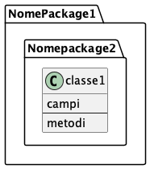

:PROPERTIES:
:ID:       6306c7b4-6cf2-46fe-8bc2-2dd8b2c6d39b
:END:
#+title: #+title: UML
#+LATEX_LISTINGS:t
#+LATEX_HEADER:\usepackage{minted}
* UML
/Unified/ /Modeling/ /Language/.  Un linguaggio di modellazione e di specifica basato sul paradigma agli oggetti. Un linguaggio che permette di disegnare in maniera standard, unficato e quindi universalmente comprensibile diversi diagrammi.
** Object oriented analysis
Delle figure della compagnia esperte di Object Oriented analysis cercano di capire il dominio che il nostro cliente chiede di analizzare: prende consapevolezza degli oggetti nel mondo reale e identifica le identità.
*** Fasi object Analysis
1. Identificare le entità
   2. Modellare le entità in uml
      3. Creazione delle classi in java
         4. Creazione dell'applicazione in java

** Basi del linguaggio
Ciò che studieremo saranno i diagrammi delle classi. I diagrammi delle classi si compongono di package di classi che possono contenere classi o a loro volta altri package detti subpackage. Ogni package è una cartella che contiene classi (file).
*** diagramma UML
#+begin_src plantuml :file test3.png
@startuml
class NomePackage1.Nomepackage2.classe1 {
        campi
        ---
        metodi
}
@enduml
#+end_src

#+RESULTS:

prendiamo per esempio la classe Rettangolo in Java

#+begin_src java
class Rettangolo{
    private double x,y,lunghezza;
    private double altezza;

    public Rettangolo(double x, double y, double lunghezza)
        {
            this.x = x;
            this.y = y;
            this.lunghezza = lunghezza;
        }
    public void trasla(double x, double y)
        {
            this.x = x;
            this.y = y;
        }
    public String toString()
        {
            double x2 = x + lunghezza;
            double y2 = y + lunghezza;
            return "("+x+","+y+")" +"("+x2+","+"y2"+")";
        }
}
#+END_src
in uml:
#+begin_src plantuml :file rettnagolo_uml.png
class Rettangolo{

}
#+END_src
*** Visibilità
~+~ visibilità pubblica: Ogni elemento che può accedere alla classe può anche accedere a ogni suo membro con visibilità pubblica
~-~ Visibilità privata: solo le operazioni della classe possono accedere ai membri della classe.
~#~ Visibilità protetta: solo le operazioni della classe e delle sue sottoclassi possono accedere alla classe.
~~~ Visibilità package: ogni elemento nelo stesso package della classe (o suo sottopackage annidato) può accedere ai membri della classe con visibilità package.
