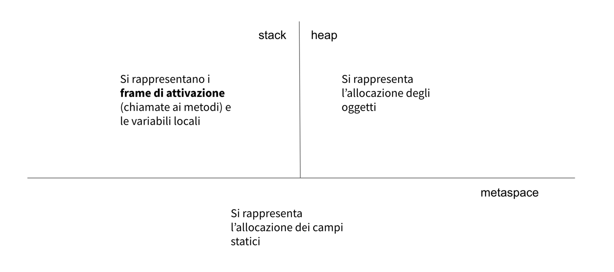

:PROPERTIES:
:ID:       74295e9a-da30-42fe-bb04-de5e6d5a4166
:END:
#+title: heap, stack e metaspace
#+LATEX_LISTINGS: t
#+LATEX_HEADER: \usepackage{minted}

L'heap e lo stack e il metaspace sono le tre aree utilizzate per gestire la memoria.

* Rifermenti
I rifermenti sono indirizzi in memoria. Gli Oggetti non sono mai memorizzati nella variabili, ma viene memorizzato il loro riferimento.

* Heap e stack
** Heap
Lo heap la zona in cui vengono allocati gli oggetti dinamicamente dinamica della memoria.
** Stack
In questa zona vengono allocate le variabili locali.
* Campi classe
I campi di una classe possono essere dichiarati static. Un campo static è relativo all'intera classe, non al singolo campo. se abbiamo un campo dichiarato static ogni volta che faremo una operazione. Un campo static esiste in una sola locazione di memoria, allocata prima di qualsiasi oggetto della
classe in una zona speciale di memoria nativa chiamata ~MetaSpace~.

#+begin_src java
public class ContaIstanze
    {
        static private int numeroDiIstanze; //inizializzato a zero
        public ContaIstanze()
            {
                numeroDiIstanze++;
            }
        public String toString()
            {
                return Integer.toString(numeroDiIstanze);
            }
        public static void main(String[] args)
            {
                new ContaIstanze();
                new ContaIstanze();
                new ContaIstanze();
                System.out.println(ContaIstanze.numeroDiIStanze);
            }
    }

#+end_src

#+RESULTS:
: 3

* Metodi statici
:PROPERTIES:
:ID:       89153790-b942-4cfa-842b-da4f58a6b590
:END:
Un metodo statico è un metodo che non può accedere alle variabili di istanza, ma possono accedere alle variabili di istanza. Per chiamare un metodo statico possiamo semplicemente chiamare ~nomeclasse.metodoStatico~.

#+DOWNLOADED: screenshot @ 2026-05-07 19:30:38

