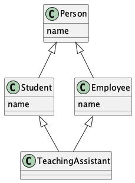

#+title: Interfacce
#+LATEX_LISTINGS: t
#+LATEX_HEADER: \usepackage{minted}
#+LATEX_HEADER: \usepackage{tabularx}

* Cos'è una interfaccia
Le interfacce vengono usate per consentire a più classi di fornire e implementare più metodi comuni. Le interfacce definiscono e standardizzano l'interazione fra oggetti tramite un insieme di metodi comuni. Le interfacce sono classi astratte.
* Dichiarazione di una interfaccia
Le interfacce sono classi astratte. Tutti i metodi delle interfacce sono astratti e non si possono definire implementazioni, anche se da Java 9 è possibile definire delle implementazioni di default dei metodi con la parola chiave ~default~. I campi sono costanti ~final public static~. Si possono dichiarare metodi private per il riuso del codice.

#+begin_src java  :tangle esempi/SupportoRiscrivibile.java
public interface SupportoRiscrivibile{
    int TIMES = 100;
    void leggi();
    void scrivi();
}
#+end_src

#+RESULTS:

#+begin_src java :tangle esempi/Nastro.java

public class Nastro implements SupportoRiscrivibile{
    private Pellicola pellicola;
    @Override
    public void leggi(){
        attivaTestina();
        muoviTestina();
    }
    @Override
    public void scrivi(){
        attivaTestina();
        caricaTestina();
        muoviTestina();
        scaricaTestina();
    }
    public void attivaTestina(){}
    public void caricaTestina(){}
    public void scaricaTestina(){}
    public void muoviTestina(){}
}

#+end_src
** metodi di default

#+begin_src java

public interface Loggabile{
    // loglevel è una enum probabilmente
    private void log(String msg, LogLevel level)
        {
            ...
        }
    default void logInfo(String msg) {log(msg,LogLevel.INFO)}
    default void logWarn(String msg) {log(msg,LogLevel.WARNING)}
    default void logError(String msg) {log(msg, LogLeve.ERROR)}
}

#+end_src

* Perché usare una interfaccia?
Le interfacce permettono di modellare comportamenti comuni a classi che non sono in relazione gerarchica. Inoltre una classe può ereditare da più interfacce, le
** Problema del diamante
Java non possiede meccanismi per l'ereditarietà multipla,per buone ragioni: si possono creare situazioni poco chiare di duplicazione di metodi e campi. Uno dei problemi che sorge in pratica è il problema del diamante.

Ad esempio:
#+begin_src plantuml :file diamante.png
@startuml
Person <|--Student
Person <|--Employee
Employee<|-- TeachingAssistant
Student <|--TeachingAssistant
class Person{
        name
}
class Student{
        name
}
class Employee{
        name
}
@enduml
#+end_src

#+RESULTS:

Qui TeachingAssistant eredita da Student ed Employee due campi con lo stesso nome e questa genera ambiguità. In java l'eredità multipla non esiste con le classi ma si può ripresentare con le interfacce. Se le interfacce hanno 2 metodi di default allora bisogna scegliere quello che vogliamo chiamare o reimplemntarlo noi:

#+begin_src java
public interface A{
    void ciao() {System.out.println("ciao da A");}
}
public interface B{
    void ciao(){System.out.println("ciao da B");}
}

public class C implments A,B {
    @Override
    void ciao(){
        A.super.ciao();
    }
}
#+end_src

* Interfacce notevole
#+LATEX_HEADER: \usepackage{tabularx}
#+ATTR_LATEX: :environment tabularx :width \textwidth :align lX
| Interfaccia  | Descrizione                                                                                                                                                                            |
|--------------+----------------------------------------------------------------------------------------------------------------------------------------------------------------------------------------|
| Comparable   | Impone un ordinamento naturale degli oggetti tramite il metodo: int compareTo(T b), che restituisce un valore >, =,  < 0 se l'oggetto è rispettivamente maggiore, uguale o minore di b |
| Clonable     | Le classi che implementano quest'interfaccia dichiarano al metodo clone() che si può fare una copia campo-campo delle istanze.                                                          |
| Serializable | Questa interfaccia non possiede metodi o campi e serve soltanto ad identificare il fatto che l'oggetto è serializzabile, ciòe: memorizzabile su un supporto                            |
|--------------+----------------------------------------------------------------------------------------------------------------------------------------------------------------------------------------|

* Le interfacce Iterable e java.util.Iterator
Le interafface Iterable e Iterator permettono di avere iterare sugli oggetti di tipo collection.
** Iterable
Un'interfaccia fondamentale che permette di iterare su collezioni.
ha come metodi:
| Metodo            | Descrizione                                                    |
|-------------------+----------------------------------------------------------------|
| boolean hasNext() | Restituisce true se esiste ancora un elemento nella collezione |
| E next()          | Restituisce l'elemento successivo                              |
| void remove()     | rimuove l'elemento corronte                                    |
|-------------------+----------------------------------------------------------------|

#+begin_src java  :tangle esempi/Jukebox.java

import java.util.ArrayList;
import java.util.Iterator;

public class Jukebox{
    private ArrayList<Canzone> canzoni = null;

    public void addCanzone(Canzone c){
        canzoni.add(c);
    }

    @Override
    public Iterator<Canzone> iterator(){
        return canzoni.iterator();
    }

}

#+end_src

* Interfacce funzionali
Le interfacce permettono il passaggio di input di funzioni con determinata intestazione questa è fatta rispettare dal compilatore.

#+begin_src java
public interface Runnable
{
void run();
}

public Parlare implements Runnable{
    public void run(){System.out.println("hello world");}

}
#+end_src
